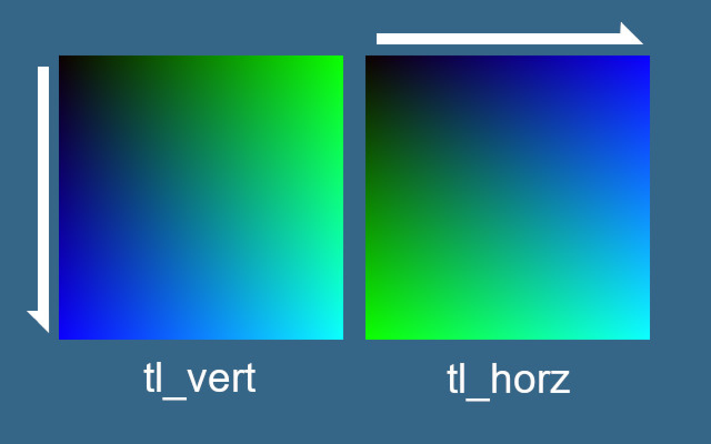

# 17 Million Colors
## Full-RGB-Spectrum-Generator

---
17 Million Colors is a program for designing and creating images containing all 16,777,216 RGB Values.

*Why is this useful?*
- The images generated using this program can act as either a best or worst case scenario when testing graphics based programs.

- The images generated using this program can be used to easily test the efficiency and loss of different compression algorithms.

- The images generated using this program look cool! 

---

## Building the Program
---

To build this program, you will need a C++ compiler and and installation of OpenCV 3.0 or greater. OpenCV can be downloaded [here](https://opencv.org/releases/).

Once OpenCV is installed, there are a few paths that you will need to know for compilation.

The first of these is the "includes" directory, which should look something like this:

` {$ Complete path leading up to opencv directory}\opencv\build\include `

The second is a path the OpenCV library directories, which should look something like this:

`{$ Complete path leading up to opencv directory}\opencv\build\{platform (x64 in my case)}\{highest available version (v15 in my case)}\lib `

The last thing needed is the name of the library dependency that we are using from the library directories folder. If you are compiling in the debug configuration this will be `opencv_world410d.lib`, and if you are compiling in the release configuration this will be `opencv_world410.lib`.

With these paths you now have everything you need to compile the program. Below are more detailed instructions on how to compile in Visual Studio, but other IDEs should follow a similar process.

### Building the program in Visual Studio 
The first thing you need to do in Visual Studio is create an empty c++ solution, and then import `main.cpp`, `Rgb_Spectrum.h`, and `Rgb_Spectrum.cpp`.

Once you have the files in your solution, ensure that your project is set to same platform you've selected in your library directories path above.

If you plan on writing your own `main` to generate images I recommend that you leave your solution configuration to debug, otherwise change it to release.

Once your platform and configurations are set, right click on the solution name in solution explorer and select properties.

In the properties panel, click on `C/C++`, and in the `C/C++ -> General` tab click on `Additional Include Directories` and select edit. Add a new line and paste your "includes" directory path (as described above). Click `OK` to close the `Additional Include Directories` panel.

Now, while still in the properties panel, click on `Linker`, and in the `Linker -> General` tab click `Additional Library Directories` and select edit. In the `Additional Library Directories` panel create a new line and paste in your OpenCV library directory path. Click `OK` to close the `Additional Library Directories` panel.

Finally in the properties panel, navigate to the `Linker -> Input` tab, and add the name of the library dependency lib file mentioned above. Click `OK` to exit the `Input` panel, and then click `Apply` in the properties panel to apply all of the new settings.

With all of the proper settings applied the Visual Studio shouldn't be showing any errors, and the program can be built by clicking on `Build Solution` in the `Build` drop down menu.

A video walking you through all these steps can be found [here](https://youtu.be/l_4fNNyk1aw)

## Using the Program
---

Before going into detail about the interactive creation mode, I want to cover the basics of the program.

Since the goal of the program is to create images with exactly one occurrence of each RGB value, each image needs to contain 16,777,216 (256 ^2) pixels. Luckily the square root of 256 ^2 is an integer, so a square image with the dimensions of 4096 * 4096 can be created. This program then takes that image and divides it into 256 smaller squares, these 256 _256 * 256_ squares will be referred to as _tiles_.

Seeing as each channel in an RGB value has a range of 256, each tile has been made to represent the full range of colors available with a locked R channel, the R value that a tile has is dependent on when it is called in the program (i.e. the first tile generated will contain the RGB values of \[0, 0, 0\] - \[0, 255, 255\]; the next tile generated will contain the RGB values \[1, 0, 0\] - \[1, 255, 255\]; this continues until the last tile is reached which will contain the values of \[255, 0, 0\] - \[255, 255, 255\]).

Each tile can be filled with one of eight fill methods within the program.

These methods are:
- tl_vert
- tl_horz
- bl_vert
- bl_horz
- tr_vert
- tr_horz
- br_vert
- br_horz

The naming convention used for these methods might not seem intuitive at first, but they are simple. Each method name follows the format of {`darkest corner`}_{`direction of progression`}. 

The `darkest corner` descriptor is made up of two letters. The first letter can either be `t` or `b`, which stand for `top` and `bottom` respectively. The second letter can either be 'l' or 'r', which stands for `left` and `right` respectively. In the case of the first method `tl_vert` the  `top left` is the darkest corner of the tile.

The `direction of progression` descriptor can have one of two values `vert ` or  `horz` standing for `vertical` and `horizontal` respectively. When the RGB values in the program are progressed the blue value is increased by one, if the blue value is already at the max value of 255 the added value pushed the blue value back to 0 and the added value then falls into the green channel (i.e If the RGB value is at \[0,0,0\] adding to it will result in the value of the blue channel increasing resulting in \[0, 0, 1\], but if the RGB is \[0, 0, 255\] adding to it will result in the blue channel overflowing into the green channel causing \[0. 1. 0\]). As a result of value being passed into the blue channel, the direction described by the `direction of progression` descriptor will be the most blue of the tile as seen below.

In addition to the single tile methods there are also thirteen `quad` methods which combine different combinations of tile fill methods into groups of four. The three quad method styles are explained below.

  

*dark_corners*

A grouping that places the darkest corners of each tile on the edges of the quad. The `vert` and `horz` in the method names apply to all tiles within the quad.      

  

*light_corners*

A grouping that places the lightest corners of each tile on the edges of the quad. The `vert` and `horz` in the method names apply to all tiles within the quad.      

  

*wave*

A grouping that creates a wave effect where the top two tiles are made to look like they raise above or fall behind the bottom two tiles. The `darkest corner` descriptors in the method names describe only the top left tile of the quad, but the `direction of progression` descriptor describes all tales within the quad.   

  

*weave*

Quads that whan grouped together create a weaved effect. Both the `darkest corner` and `direction of color progression` descriptors in the method names for this quad only describe the top left tile.     

The final type of fill method to discuss are the full fill methods. A full fill method exists for evert individual tile and quad method, and they are designed to fill the full image with the above mentioned fill methods.

### Interactive Creation Mode

Interactive creation mode is enabled by default, and will run when the program is called. 

In interactive creation mode the tiles of a blank image are labeled, and the user is prompted for information on how to fill the image. Tiles can be filled in any order with any method, and the image can be saved at any time after the user give the prompt a `-3` to quit from fill mode. Any numbers remaining in the image will be erased.

When using quads in interactive fill mode the user is asked for a minimum tile amount, if the quad will fill less than the minimum amount of tiles due to overlap, the quad won't be created.

The user has the option to record a sequence of commands that can be repeated over and over again in different locations in an image. The sequence of commands has no size limit and can be used with individual tiles and quads. This feature make actions like creating your own quads and repeating them through the image easy.
